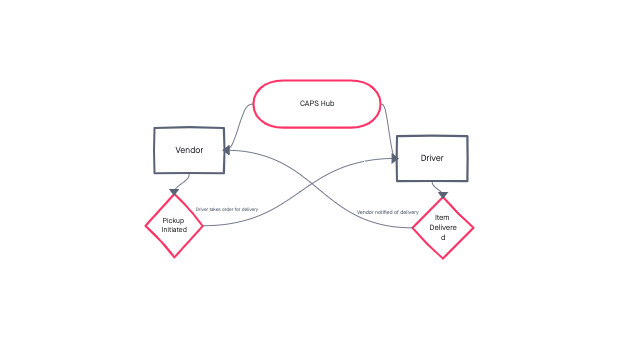

# caps

# Class-11 - Lab

## Project: CAPS

### Author: Rachael Rice

### Links and Resources

- [ci/cd](https://github.com/Rachnicrice/caps/actions)
- [back-end server url]()

### Setup

#### `.env` requirements

#### How to initialize/run your application (where applicable)

- `npm i`
- `npm run start`

#### Tests

- How do you run tests? npm run test
- Describe any tests that you did not complete, skipped, etc

#### UML

